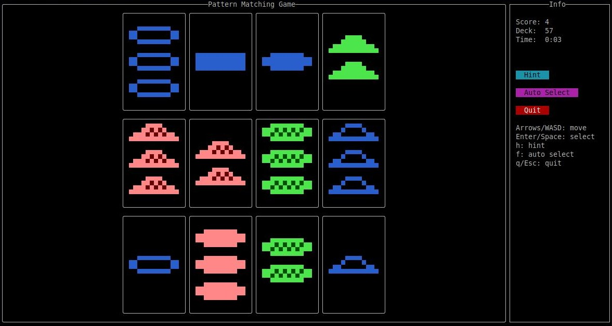

# set-rs

A terminal and browser implementation of the [SET card game](https://en.wikipedia.org/wiki/Set_(card_game)) in Rust. Uses [ratatui](https://ratatui.rs) for rendering and [ratzilla](https://github.com/ratzilla-rs/ratzilla) for the web target.

[**Play it in the browser**](https://leonardopl.github.io/set-rs/)



## Features

- Full 81-card deck with half-block Unicode rendering
- Keyboard, mouse, and clickable UI buttons
- Visual feedback for valid/invalid SETs
- Progressive hints and auto-select
- Score tracking and timer
- Runs in terminal or browser (WASM)

## Controls

| Action         | Input                          |
|----------------|--------------------------------|
| Move           | Arrow keys / `W` `A` `S` `D`  |
| Select card    | `Enter` / `Space`              |
| Hint           | `H`                            |
| Auto-select    | `F`                            |
| Quit           | `Q` / `Esc`                    |

Mouse clicks work on both cards and sidebar buttons.

## Getting Started

### Prerequisites

- [Rust](https://www.rust-lang.org/tools/install) (1.85+)
- [Trunk](https://trunkrs.dev/) (web build only)
- `wasm32-unknown-unknown` target (web build only):
  ```sh
  rustup target add wasm32-unknown-unknown
  ```

### Run

```sh
# Terminal
cargo run

# Browser (WASM)
trunk serve --features web --no-default-features
```

### Build for Release

```sh
# Terminal
cargo build --release

# Browser (WASM)
trunk build --release --features web --no-default-features
```

## Architecture

```
src/
  main.rs     Entry point
  app.rs      App state and main loop
  game.rs     SET game logic
  input.rs    Keyboard and mouse handling
  ui.rs       Board and card rendering
  event.rs    Terminal event loop
index.html    Trunk entry point for WASM
```
